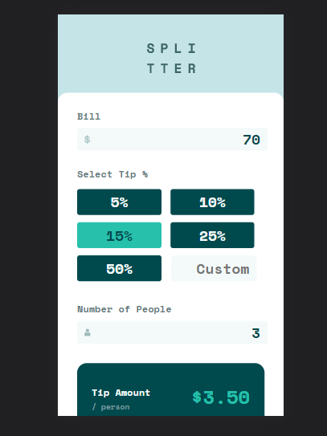
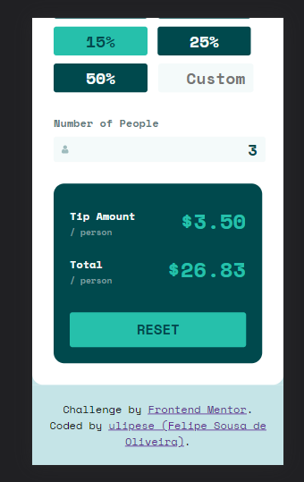
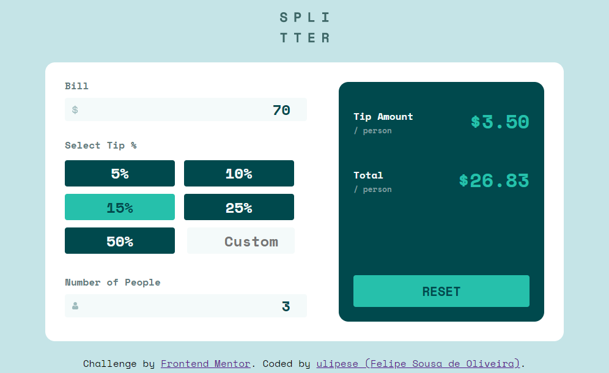

## Table of contents

- [Overview](#overview)
  - [The challenge](#the-challenge)
  - [Screenshot](#screenshot)
  - [Demo](#demo)
- [My process](#my-process)
  - [Built with](#built-with)
  - [What I learned](#what-i-learned)
- [Author](#author)

## Overview

### The challenge

  - Create the site as close as possible  
  - Add animations.

### Screenshot

#### Mobile

#### Desktop

### Demo

<a href="https://ulipese.github.io/tip-calculator-app/">See the demo here</a>

## My process

1. I saw the layout (see the directory 'design')
2. I started to code doing mobile design
3. I did the functionalities with js
4. I finished doing the desktop layout

### Built with

- Semantic HTML5 markup
- JS
- CSS

### What I learned

I learned more about JS and the DOM.

## Author

- Linkedin - [Felipe Sousa](https://www.linkedin.com/in/felipe-sousa-0311491b3/)
- Github - [Felipe Sousa](https://www.github.com/ulipese)
- Frontend Mentor - [@ulipese](https://www.frontendmentor.io/profile/ulipese)
- Twitter - [@ulipese](https://www.twitter.com/ulipese)